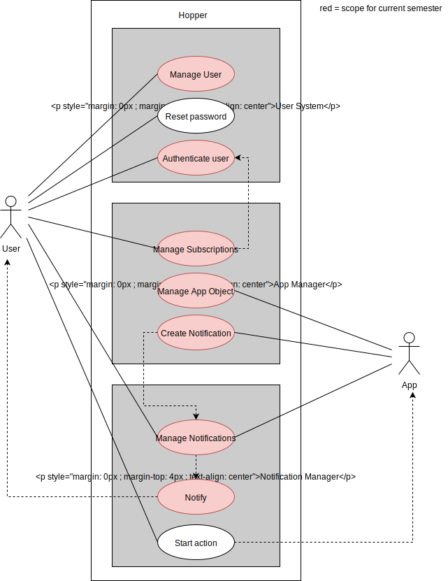
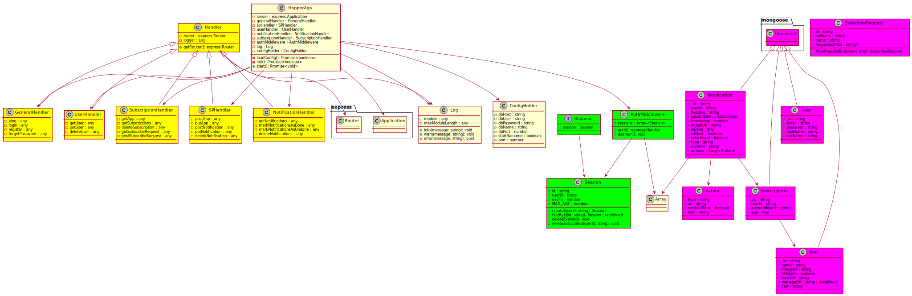
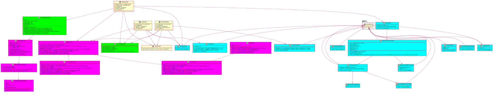
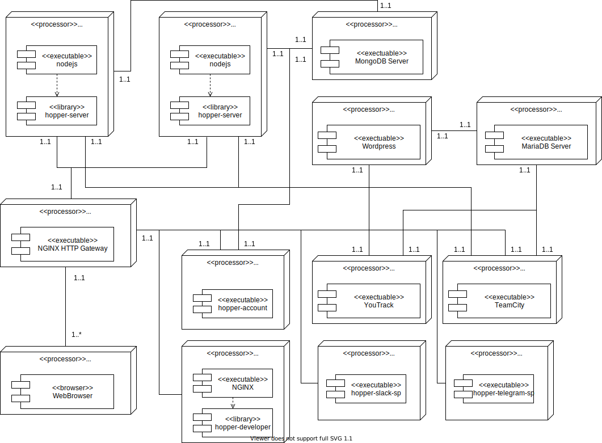
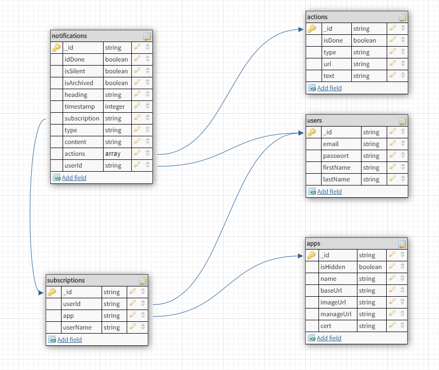

# Software Architecture Document

# Table of Contents
- [1. Introduction](#1-introduction)
  * [1.1 Purpose](#11-purpose)
  * [1.2 Scope](#12-scope)
  * [1.3 Definitions, Acronyms and Abbreviations](#13-definitions--acronyms-and-abbreviations)
  * [1.4 References](#14-references)
  * [1.5 Overview](#15-overview)
- [2. Architectural Representation](#2-architectural-representation)
- [3. Architectural Goals and Constraints](#3-architectural-goals-and-constraints)
  * [3.1 Server-side](#31-server-side)
  * [3.2 Client-side](#32-client-side)
- [4. Use-Case View](#4-use-case-view)
  * [4.1 Use-Case Realizations](#41-use-case-realizations)
- [5. Logical View](#5-logical-view)
  * [5.1 Overview](#51-overview)
  * [5.2 Architecturally Significant Design Packages](#52-architecturally-significant-design-packages)
- [6. Process View](#6-process-view)
- [7. Deployment View](#7-deployment-view)
- [8. Implementation View](#8-implementation-view)
- [9. Data View](#9-data-view)
- [10. Size and Performance](#10-size-and-performance)
- [11. Quality/Metrics](#11-quality-metrics)

## 1. Introduction

### 1.1 Purpose
This document provides a comprehensive architectural overview of the system, using a number of different architectural views to depict different aspects of the system. It is intended to capture and convey the significant architectural decisions which have been made on the system.

### 1.2 Scope
This document describes the architecture of the hopper project.

### 1.3 Definitions, Acronyms and Abbreviations

| Abbrevation | Description                            |
| ----------- | -------------------------------------- |
| API         | Application programming interface      |
| MVC         | Model View Controller                  |
| REST        | Representational state transfer        |
| SDK         | Software development kit               |
| SRS         | Software Requirements Specification    |
| UC          | Use Case                               |
| VCS         | Version Control System                 |
| n/a         | not applicable                         |

### 1.4 References

| Title                                                              | Date       | Publishing organization     |
| -------------------------------------------------------------------|:----------:| -------------------------   |
| [Hopper Blog](https://blog.hoppercloud.net/)                       | 2017-11-26 | The hopper team             |
| [GitHub - Server](https://github.com/hopperteam/hopper-server)     | 2018-06-11 | The hopper team             |
| [GitHub - Documentation](https://github.com/hopperteam/hopper-doc) | 2018-06-11 | The hopper team             |
| [UC Filter for SP](uc-filter-for-sp.md)                            | 2017-12-06 | The hopper team             |
| [UC Set Notification Done](uc-set-notification-done.md)            | 2017-12-06 | The hopper team             |
| [UC Invite New Group Member](../UC/UC_Invite_New_Group_Member.md)  | 2017-12-06 | The hopper team             |
| [SRS](srs.md)                                                      | 2017-11-26 | The hopper team             |
| [API Documentation](api.md)                                        | 2017-11-26 | The hopper team             |
| [API Data Types](dataTypes.md)                                     | 2017-11-26 | The hopper team             |
| [Subscription Process Documentation](subscriptionProcess.md)       | 2017-11-26 | The hopper team             |

### 1.5 Overview
This document contains the Architectural Representation, Goals and Constraints as well 
as the Logical, Deployment, Implementation and Data Views.

## 2. Architectural Representation
We are using ReactJS by facebook. It is built on a custom architecture called flux. Flux is a modified and extended version of the MVC pattern.

Documentation of flux can be found [here](https://github.com/facebook/flux).

## 3. Architectural Goals and Constraints
Both client and server use the MVC pattern. The data is synchronized via a sync-layer, which uses custom logic to load only the required data from the backend into the frontend. 

### 3.1 Server-side
The server is implemented in NodeJS. It provides a RESTful API which represents the "View" and the "Controller" aspect of the MVC model. The `GET`-requests represent the view part of the model. They are not views in the traditional way, but they are a method to display the data, which is why we classify them as a view. Any `POST`, `PUT` and `DELETE` requests.represent the controller part. They can control the data in the model and implement specific actions (e.g. notifying the user when a new notification occurs). That means the view and the controller are implemented in the same classes, in the so-called `Handler`s.

The model is implemented via [Mongoose](https://mongoosejs.com/), which is a `ODM`-Tool. That means mongoose handles all database connections and we can query data directly from the specific classes. `ODM` is the document-based counterpart for `ORM`.

### 3.2 Client-side
The hopper client is implemented in TypeScript with ReactJS. That means it does not have a classic ERM model, but a much more complicated model called `flux`. To explain flux would exceed the scope of this document.

To summarize: There are four main compontents in the application: The `Actions` and the `Dispatcher` (which represent the controller in a classic MVC model) manage user interaction. The `Store` (which represents the model aspect) holds the data and notifies the view about changes. The view is represented by the `React Views`.

## 4. Use-Case View

### 4.1 Use-Case Realizations
One example use case realization is the [filter-for-sp use case](./uc-filter-for-sp.md). 
When the user clicks on a SP filter, the `Dispatcher` dispatches an event to the `Store`. The `Store` stores the selected SP and sends an update event to the view. The view requests notifications from the selected SP and displays them. When there are not enough notifications downloaded from the backend, an action is created to communicate with the backend and load more notifications. When the loading is finished, the notifications are integrated into the `Store`, which sends an update event to the view. This could process repeats.

## 5. Logical View

### 5.1 Overview

### 5.2 Architecturally Significant Design Packages

This is our UML diagram, in which the different parts are colorized.

Legend:

color  | meaning
-------|--------
purple | model
light blue | view
green  | controller
yellow | controller + view combined (as explained in 3)

Backend:

Frontend:

## 6. Process View
(n/a)

## 7. Deployment View

## 8. Implementation View
(n/a)

## 9. Data View
Database Schema:

## 10. Size and Performance
(n/a)

## 11. Quality/Metrics
(n/a)
