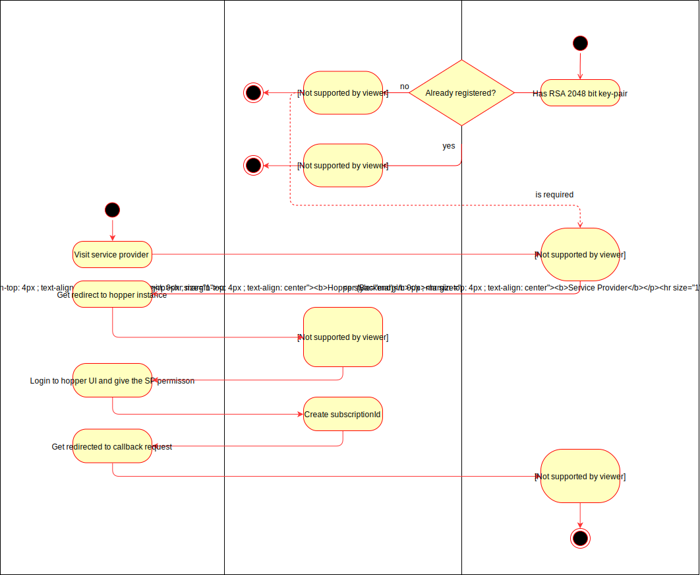

# Subscription Process
This document outlines the subscription process, SPs have to go through, to be able to send notifications to users in hopper.

## Prerequisites
The service provider is required to be reachable in the public internet via HTTPS to be able to receive subscription tokens.

Each service provider is required to have a RSA 2048 bit key-pair. This is required for authentication to hopper.


## Registration
First, the service provider performs the `POST /app` request to sign up (available in the API-documentation). the certificate is the Base64-PEM-encoded public key of the backend. 

## Updates
To update the service provider, the `PUT /app` request is performed. The `content` object is a base64-encoded json object. It's `verify` attribute contains the with the private key of the SP encrypted and base64-encoded sha256 hash of `content`'s `data` object. Furthermore the request body contains a `id` field with the id of the SP.

## Subscription Process
To subscribe a user to a SP, the SP has to create a `SubscribeRequest` for the user. The sha256 hash of this request gets encrypted with the private key of the SP and is then base64-encoded. The resulting string is added to the `verify` attribute of the request json object. The SubscribeRequest json object is added to the `data` attribute of the request object. The request object is finally base64-encoded which will be used in the `content` query parameter for the subscription.

The user is then navigated to this URL:
```URL 
  {{hopper-instance}}/subscribe?id={{spId}}&content={{base64-request}}
```
Hopper will verify the SPs identity by decoding the request with the specified public key.

When the identity is verified, the user will see an UI which to login and give the SP permission. After that, the subscription is created and a `subscriptionId` is generated. 

The user is navigated to the callback, specified in the `SubscribeRequest`. The user will be navigated via an `GET` request, which will receive 2 of 3 query parameters: 
  - `status`: Either `"success"` or `"error"`
  - `error`: In case of `"error"`: The error message.
  - `subscriptionId`: In case of `"success"`: The `subscriptionId`
  
After that, the subscription process is done and the SP can send notifications to the user using the `subscriptionId`.  
  


