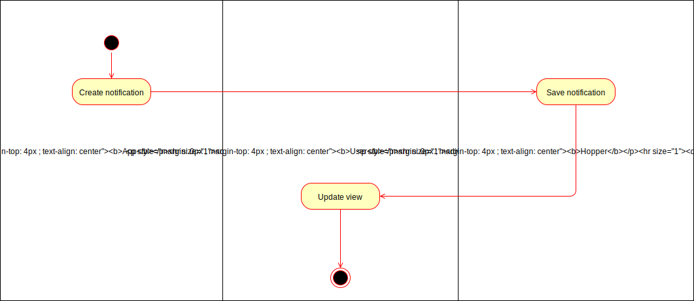

# 1 UC: Subscribe to app

## 1.1 Brief Description
When a user has a subscription, he can receive notifications by the app on this subscription

# 2 Flow of Events
## 2.1 Basic Flow
- App sends notification to subscription
- User receives notification

### 2.1.1 Activity Diagram

## 2.2 Alternative Flows
(n/a)

# 3 Special Requirements
(n/a)

# 4 Preconditions
- User has to have a subscription to app

# 5 Postconditions
## 5.1 Notification created
The notification is created and received an id
## 5.2 Notification visible in frontend
The notification is visible in the user's frontend (when user has not filtered it out)
 
# 6 Extension Points
(n/a)
