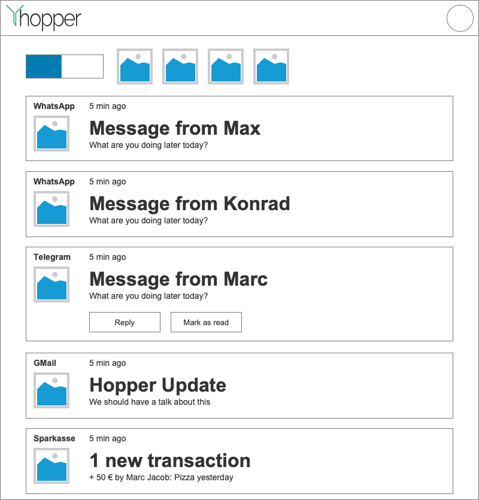

# 1 UC: Delete notification

## 1.1 Brief Description
When the user has a notification, he can click on a "delete" button and the notification will be deleted.

# 2 Flow of Events
## 2.1 Basic Flow
- User clicks on "delete" for one notification
- Notification will be deleted

### 2.1.1 Activity Diagram

### 2.1.2 Mock-up

## 2.2 Alternative Flows
(n/a)

# 3 Special Requirements
(n/a)

# 4 Preconditions
## 4.1 Logged in
The user has to be logged in to the system.
## 4.2 User has at least one notification
The user has to have at least one notification in the current filter for the SP to become visible, to filter for it.

# 5 Postconditions
## 5.1 Notification deleted
The notification is deleted afterwards.
## 5.2 Notification not visible
The deleted notification should not be visible anymore.
 
# 6 Extension Points
(n/a)
