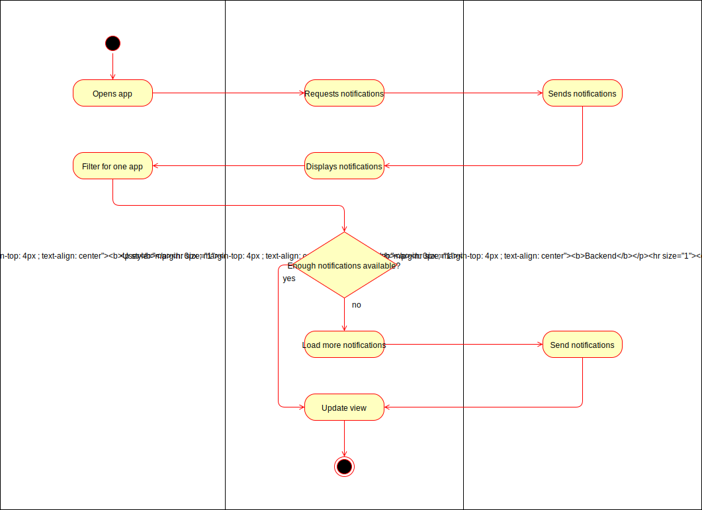
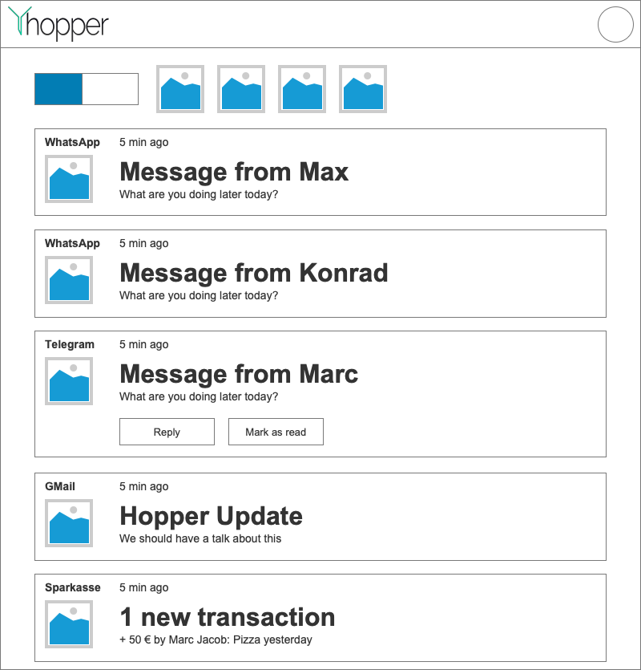

# 1 UC: Filter notifications for one App

## 1.1 Brief Description
Every user will receive notifications. These notifications will be filterable by the app which sent them.

When the user selects one app, only notifications by this app should be visible.

# 2 Flow of Events
## 2.1 Basic Flow
- User selects one app from the list of the providers
- Only notifications from this app will be visible

### 2.1.1 Activity Diagram


### 2.1.2 Mock-up


### 2.1.3 Narrative
The productive gherkin file can be found [in the project](https://github.com/hopperteam/hopper-ui/blob/master/test/filter_for_sp.feature).
```gherkin 
Feature: Filter for app

  Scenario: Simple filter for app
    Given User is on hopper
    And User is logged in
    And User has open Notification "Test" by "TestApp"
    And User has open Notification "Test2" by "TestApp2"
    And No AppFilter is selected
    And Checkbox "SeeAllNotifications" is not checked
    When User clicks on AppFilter "TestApp"
    Then Notification "Test" should be visible
    Then Notification "Test2" should not be visible
    Then AppFilter "TestApp" should be selected

  Scenario: Deselect filter for app
    Given User is on hopper
    And User is logged in
    And User has open Notification "Test" by "TestApp"
    And User has open Notification "Test2" by "TestApp2"
    And AppFilter "TestApp" is selected
    And Checkbox "SeeAllNotifications" is not checked
    When User clicks on AppFilter "TestApp"
    Then Notification "Test" should be visible
    Then Notification "Test2" should be visible
    Then AppFilter "TestApp" should not be selected

  Scenario: Switch filter for app
    Given User is on hopper
    And User is logged in
    And User has open Notification "Test" by "TestApp"
    And User has open Notification "Test2" by "TestApp2"
    And AppFilter "TestApp" is selected
    And Checkbox "SeeAllNotifications" is not checked
    When User clicks on AppFilter "TestApp2"
    Then Notification "Test" should not be visible
    Then Notification "Test2" should be visible
    Then AppFilter "TestApp" should not be selected
    Then AppFilter "TestApp2" should be selected
```

## 2.2 Alternative Flows
(n/a)

# 3 Special Requirements
(n/a)

# 4 Preconditions
## 4.1 Logged in
The user has to be logged in to the system.
## 4.2 User has at least one notification
The user has to have at least one notification in the current filter for the app to become visible, to filter for it.

# 5 Postconditions
## 5.1 App highlighted
The selected app is highlighted in some way.
## 5.2 Only app's notifications visible
Only the notifications, sent by the selected app, will be visible.
 
# 6 Extension Points
(n/a)
