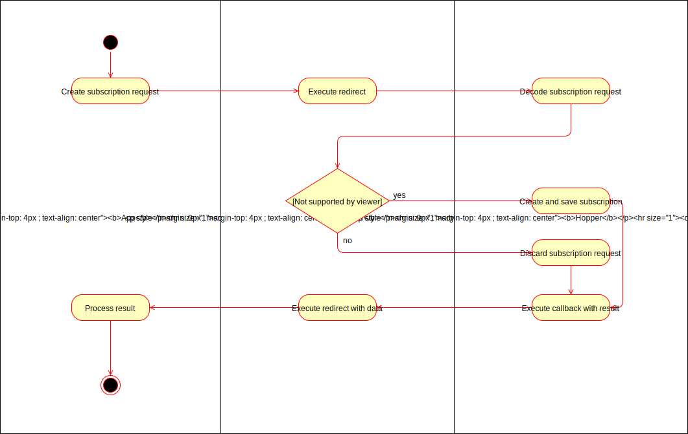

# 1 UC: Subscribe to app

## 1.1 Brief Description
The user can subscribe to an app. The app has to redirect the user to hopper's subscription handler. The service provider will be notified about the result.

# 2 Flow of Events
## 2.1 Basic Flow
- App builds subscriptionRequest
- User gets redirected to subscription handler
- Hopper decrypts, validates and displays subscription request data
- User decides weather to accept or decline the request
- User gets redirected to app with the result

### 2.1.1 Activity Diagram

## 2.2 Alternative Flows
When user is not logged when redirected to subscription handler:
 - User will be redirected to login screen and can login sign up
 - After that user is redirected back to the subscription handler

When user accepts the request:
 - Subscription is created by hopper
 - Redirection to app contains subscription's id

# 3 Special Requirements
(n/a)

# 4 Preconditions
(n/a)

# 5 Postconditions
## 5.1 Subscription created
The subscription is created and received an id
## 5.2 Subscription visible in frontend
The subscription is visible in the user's frontend in the app filter
 
# 6 Extension Points
(n/a)
